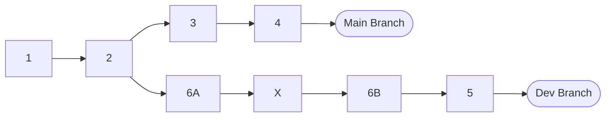

# Git Exercise

### Starting from [dev branch](https://github.com/pivotal-djoo/git-exercise/tree/dev):

- Drop commit X
- Reorder commit 5 to occur before 6A and 6B
- Squash 6A and 6B and reword this commit to 6
- Rebase dev onto main and fast-forward main so it contains all commits in order

### Goal:

